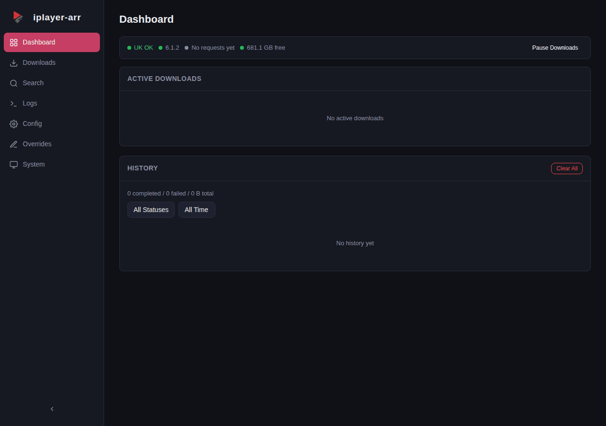

<p align="center">
  
</p>

<p align="center">BBC iPlayer download manager that plugs into Sonarr as both an indexer and download client.</p>

[](https://github.com/Will-Luck/iplayer-arr/actions/workflows/ci.yml)
[](https://github.com/Will-Luck/iplayer-arr/releases)
[](LICENSE)
[](https://github.com/Will-Luck/iplayer-arr/pkgs/container/iplayer-arr)
[](https://hub.docker.com/r/willluck/iplayer-arr)
[](https://github.com/Will-Luck/iplayer-arr/pkgs/container/iplayer-arr)
[](https://github.com/Will-Luck/iplayer-arr/pkgs/container/iplayer-arr)
[](https://github.com/Will-Luck/iplayer-arr/pkgs/container/iplayer-arr)



## How it works

Most iPlayer download tools grab programmes by URL and leave you with a file to sort out yourself. iplayer-arr speaks Sonarr's language natively -- it presents a Newznab indexer for search and a SABnzbd download client for fetching, so Sonarr treats it like any other indexer/downloader pair.

The hard part is episode numbering. BBC iPlayer doesn't follow a consistent scheme -- some shows have full series/episode metadata, others only have a position index within a series, and daily shows often have nothing but an air date. Sonarr expects TheTVDB-style S01E03 numbering, and the two rarely agree out of the box.

iplayer-arr solves this with a 4-tier resolution chain:

1. **Full** -- BBC provides series + episode number, used directly
2. **Position** -- no episode number, but the programme has a position in its series (e.g. 3rd of 6), mapped to S01E03
3. **Date** -- no numbering at all, air date used as the episode identifier (2026.01.15)
4. **Manual** -- title only, last resort

When the auto-resolved numbering still doesn't match TheTVDB (common with specials, reboots, or shows where the BBC counts differently), per-show overrides let you adjust series/episode offsets, force date-based numbering, or remap programme names -- all from the web UI.

## Features

- Newznab indexer + SABnzbd download client in one container
- 4-tier episode identity resolution with per-show overrides
- HLS stream download with quality selection (1080p/720p/540p/396p)
- Real-time dashboard with SSE progress and download history
- Built-in WireGuard VPN via hotio base image (off by default)
- Setup wizard walks you through Sonarr configuration
- BBC iPlayer search with thumbnails and one-click download
- System health page with geo check, disk usage, ffmpeg status

## Quick Start

> **Important**: You must hold a valid UK TV Licence to legally access BBC iPlayer content via iplayer-arr. iplayer-arr does not verify this and assumes you are compliant. See [DISCLAIMER.md](DISCLAIMER.md) for full legal terms.

```bash
docker run -d \
  --name iplayer-arr \
  -p 62001:62001 \
  -v iplayer-arr-config:/config \
  -v /path/to/downloads:/downloads \
  -e TZ=Europe/London \
  ghcr.io/will-luck/iplayer-arr:latest
```

Or with Docker Compose:

```yaml
services:
  iplayer-arr:
    image: ghcr.io/will-luck/iplayer-arr:latest
    container_name: iplayer-arr
    ports:
      - 62001:62001
    volumes:
      - iplayer-arr-config:/config
      - /path/to/downloads:/downloads
    environment:
      - TZ=Europe/London
    restart: unless-stopped

volumes:
  iplayer-arr-config:
```

> iPlayer requires a UK IP address. Enable the built-in VPN or run behind an existing UK VPN/proxy. See the [VPN Configuration](https://github.com/Will-Luck/iplayer-arr/wiki/VPN-Configuration) wiki page.

Open `http://localhost:62001` and the setup wizard will guide you through connecting Sonarr.

## Configuration

See the [Configuration Reference](https://github.com/Will-Luck/iplayer-arr/wiki/Configuration-Reference) for the full list of environment variables, application settings, and VPN options.

## Documentation

See the [Wiki](https://github.com/Will-Luck/iplayer-arr/wiki) for:

- [Installation](https://github.com/Will-Luck/iplayer-arr/wiki/Installation) (Docker, Compose, VPN setup)
- [Configuration Reference](https://github.com/Will-Luck/iplayer-arr/wiki/Configuration-Reference) (environment variables, settings)
- [Sonarr Integration](https://github.com/Will-Luck/iplayer-arr/wiki/Sonarr-Integration) (indexer and download client setup)
- [Web UI Guide](https://github.com/Will-Luck/iplayer-arr/wiki/Web-UI-Guide) (page-by-page walkthrough)
- [Episode Overrides](https://github.com/Will-Luck/iplayer-arr/wiki/Episode-Overrides) (fixing numbering mismatches)
- [REST API Reference](https://github.com/Will-Luck/iplayer-arr/wiki/REST-API-Reference)
- [Troubleshooting](https://github.com/Will-Luck/iplayer-arr/wiki/Troubleshooting)

## Legal

iplayer-arr is not affiliated with, endorsed by, or sponsored by the BBC. iPlayer is a trademark of the British Broadcasting Corporation. Users in the UK must hold a valid TV Licence to legally access BBC iPlayer content via this tool.

- [DISCLAIMER.md](DISCLAIMER.md) - full legal terms, TV Licence requirement, personal-use restriction
- [SECURITY.md](SECURITY.md) - security and abuse reporting via GitHub's Private Vulnerability Reporting

## Licence

GPL-3.0. See [LICENSE](LICENSE).

---

*iplayer-arr is not affiliated with, endorsed by, or sponsored by the BBC. iPlayer is a trademark of the British Broadcasting Corporation.*
